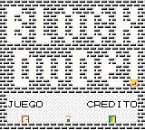

<div align="center">

# Game Design 📚

Recreacion del motor del juego de puzzle **Block Dude** de  ZX Spectrum.


</div>

## 🏁 Introdución

Se pretende recrear las mecanica vista en el juego **Block Dude** de ZX Spectrum (https://www.youtube.com/watch?v=XlAFwHMUzOI) en una GameBoy Color usando el kit de desarrollo [gbdk2020](https://github.com/gbdk-2020/gbdk-2020) .

## 💸 Monetización

No se espera ganar dinero con este proyecto, se trata de una prueba de conceptos y un MVP (Producto Minimo viable). Donde se dará los primeros contacto con el kit de desarrollo

## ⚙️Mecánicas de Juego y Elementos de Juego

### Mecanicas de juego

#### Mecanica del entorno

- Se trata de un entorno en 2d donde um personaje tiene que mover cajar para construir un camino viable hacia la puerta.
- El juego no tiene gravedad pero se espera que el personaje esté encima del suelo o una la caja en todo momento.
- En el mapa de tiles se indicará la posicion inicial de las cajas, puerta, muros, suelos y jugador. una vez vez cargado el mapa esta indicaciones desaparecerán quedando unicamente la indicacion de la puerta, muros y suelos.
- Una vez que el jugador haya ocupado la misma posicion que la puerta se dará el nivel por completando y se cargará el siguiente.

#### Mecanica del jugador

El jugador:
- Solo puede sujetar una caja que este delante de él
- Siempre suelta la caja delante de él y siempre que espacio que vá ocupar la caja esté libre
- Indicará en que direcion esta mirando ( lo que es delante o detras) mediente el sprite de personaje que tendrá la cara mirando a un lado u otro
- Se indicará que tiene una caja sujeta con un sprite donde él tiene una caja sobre su cabeza.
- Podrá subirse sobre cajas o parede siempre que la distancia sea de un sprite de 8x8
- Solo podrá portar una caja de cada vez.

### Elementos

De las mecanicas se intuye que tendremos en el "mapa" puerta, suelo,muro, caja y el jugador.
Las cajas pueden ser recogidas del suelo o de encima de otras cajas siempre y cuando el jugador pueda copupar la posicion contigua a la caja.. Ni superio ni inferior .. contigua..

Portanto las cajas puende al igual que el jugador variar su posicion los demas elementos no.

### Controles

Se usara las flecha direcionales izquierda y derecha (← y →) para mover el personaje por el mapa.
El boton A para sujetar la caja y el B para soltar la caja. 
Como atajo se pondrá la flecha superiror (↑) que tanto servirá para sujetar como para soltar la caja.

## Trasfondo

Al trataser de un MVP, no se ha establecido una historia

## Arte

Al tratar de un juego para GBC (Game boy Color) partiendo de base que es un juego originalmente de ZX Spectrum se ha optado por el "pixel art"

## Interfaz

No se implementará menus o pantallas de cargas
En la propia pantalla de inicio de juego se indicará al usuario una puerta que dice juego y otra que dice credito que sera un mapa donde se puede probar la mecanica del juego.


## 💻 Tecnologías Utilizadas

- **ANSI C**: Lenguaje de programnacion.
- **GBDK 2020**: Kit de desarrollo que incluye compilador y ensamblador de GB, SGB, CGB, NES SMS.
- **GBTD**: Elaboracion de Tiles y Sprites.
- **GBMB**: Elaboracion de Mapa y Pantallas.


## 📸 Capturas de Pantalla




## ⚙️ Configuración del Proyecto

Para configurar y ejecutar este proyecto en tu entorno de desarrollo:
Se recomienda Visual Studio CODE o Notepad++ con el plugin NPPExec

Aqui teneis un ZIP con el entorno GBDK montado **para Windows**, se recomienda ( NO ES PARA NADA NECESARIO) que se añada la direcion del compilador ( la carpeta BIN del GBDK) en el PATH del sistema para que al escribir lcc ( asi se llama el compilador) el sistema lo encuentra si necesidad de indicar todo el direcionamento.

Igualmente verá que en el proyecto he dejado un fichero de BATCH que contiene los pasos para compilar el proyecto

En la carpeta ```resource``` encontraras los mapas y sprite del juego para ser editados com GBTD y GBMB.
Estos estan exportados en la carpeta ```etc```

## 📝 Licencia

Este proyecto está licenciado bajo la Licencia MIT. Consulta el archivo [LICENSE](LICENSE) para más detalles.

## 🤝 Contribuir

Si deseas contribuir a este proyecto, te invitamos a realizar un pull request o enviar un correo a [otavioferreir@gmail.com](mailto:otavioferreir@gmail.com).

---

Desarrollado por [Otavio Ferreira Rosa](https://otomaticoscript.github.io/)
